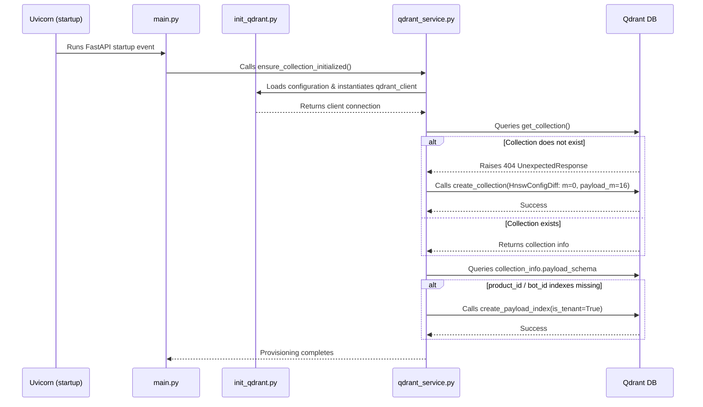

# Codebase Analysis & Qdrant Provisioning Implementation Map

This report contains a complete analysis of the codebase for the optimized Qdrant tenant configuration task.

---

## Relevant Files and Code Responsibilities

### 1. `apps/central-hub-backend/requirements.txt`
* **Relevance**: Holds backend dependencies.
* **Responsibility**: Manages packages including `qdrant-client` to allow communication with Qdrant.
* **Status**: Implemented.

### 2. `apps/central-hub-backend/src/init_qdrant.py`
* **Relevance**: Initializes the Qdrant connection.
* **Responsibility**: Reads configuration parameters from environment variables and exposes a shared `qdrant_client` instance.
* **Status**: Implemented.

### 3. `apps/central-hub-backend/src/services/qdrant_service.py`
* **Relevance**: Orchestrates provisioning and payload schemas.
* **Responsibility**: Exposes `ensure_collection_initialized()`. It handles collection existence validation, HNSW subgraph parameter setup, payload indexing on fields, and structured logging.
* **Status**: Implemented.

### 4. `apps/central-hub-backend/src/main.py`
* **Relevance**: Entrypoint of the FastAPI app.
* **Responsibility**: Starts the server and triggers dependencies during the startup lifecycle hook (`@app.on_event("startup")`).
* **Status**: Implemented.

### 5. `docker-compose.yml`
* **Relevance**: Environment management.
* **Responsibility**: Spins up the `qdrant` database instance (`chatbot-qdrant`).
* **Status**: Implemented.

---

## Configuration Details Location

The specific settings are defined and implemented in the following modules:

* **`m=0` and `payload_m=16`**: Configured inside [qdrant_service.py](file:///c:/Users/navya/Desktop/pluggable-multitenant-chatbot-engine/apps/central-hub-backend/src/services/qdrant_service.py#L26-L36) using `models.HnswConfigDiff`.
* **`is_tenant=true` on `product_id` and `bot_id`**: Configured inside [qdrant_service.py](file:///c:/Users/navya/Desktop/pluggable-multitenant-chatbot-engine/apps/central-hub-backend/src/services/qdrant_service.py#L42-L73) using `models.KeywordIndexParams(type=models.KeywordIndexType.KEYWORD, is_tenant=True)`.

---

## Startup and Execution Trace



---

## Abstraction Layers and Structure

* **Existing Abstractions**: The service layer (`src/services/`) and the client init module (`src/init_qdrant.py`) were modified/created to separate concerns logically and avoid exposing Qdrant configuration to API routers directly.
* **Missing Files**: None. All components for this feature are successfully provisioned.

---

## Feature Dependency Graph

```
Application Startup (main.py)
        ↓
qdrant_service.py (ensure_collection_initialized)
        ↓
init_qdrant.py (Qdrant Client & Env config constants)
        ↓
Collection Creation (HnswConfigDiff: m=0, payload_m=16)
        ↓
Payload Index Creation (KeywordIndexParams: is_tenant=True on product_id/bot_id)
```

---
