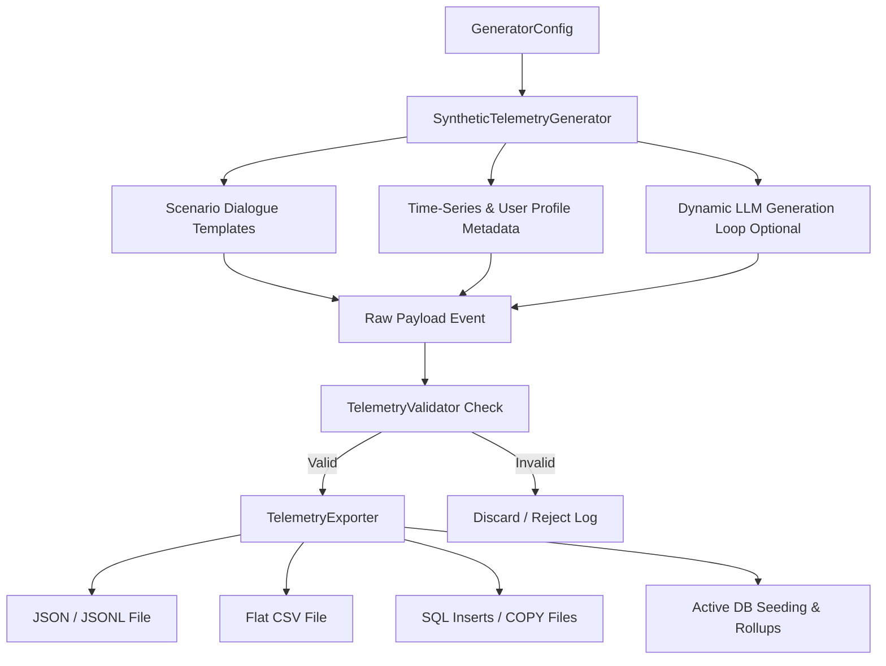

# Envoy AI Synthetic Telemetry Dataset Generation Framework

This framework generates hundreds or thousands of highly realistic, privacy-safe, non-identifiable historical chatbot conversation logs for the Envoy AI platform. These datasets seed the analytics PostgreSQL database, validate rollup aggregations, test dashboard visual widgets, and evaluate NLP intent and sales lead classifiers.

---

## Architecture Diagram

The synthetic telemetry pipeline follows a linear data generation and validation flow:



---

## Conversation Generation Strategy

The engine leverages a dual-mode strategy:
1. **Simulation Engine (Deterministic Fallback)**: Uses rich scenario templates spanning 7 separate tenant platforms (Tensor, Admissions, Internal Support, HR Portal, Placement Cell, Website Analyzer, Knowledge Base) and all 16 canonical intent categories. It runs in milliseconds and uses seeded random objects for perfect reproducibility.
2. **LLM Generation Engine (Optional)**: If `use_llm` is set to `True` and a `GROQ_API_KEY` is provided, it calls the `llama-3.3-70b-versatile` model on Groq to dynamically rephrase queries and replies, making conversations highly realistic while maintaining brand/tenant tone constraints.

---

## Canonical Intent Distributions

The generator scopes telemetry events across 16 canonical business intent categories with a configurable probability weighting. The default distribution is:

| Intent Category | Default Probability Weight | Description |
| :--- | :---: | :--- |
| **Admissions** | 12% | Admissions requirements, eligibility, deadlines, transfer credits. |
| **Course Inquiry** | 10% | Subject details, specializations, academic syllabus. |
| **Technical Support** | 10% | Out-of-memory errors, database connections, service crashes. |
| **Product Information** | 10% | Uptime SLAs, deployment setups (on-premise vs. cloud). |
| **Documentation** | 8% | Developer SDK reference, wiki files, user manuals. |
| **Pricing** | 8% | Developer seat costs, GPU cluster prices, discount queries. |
| **General Information** | 8% | Operating hours, office locations, hybrid policies. |
| **Sales Inquiry** | 6% | Seat licenses, request quotes, schedule sales presentation. |
| **Billing** | 5% | Declined credit cards, ACH transfers, payment plans. |
| **Registration** | 5% | API key console registration, Workday account set up. |
| **Enterprise Inquiry** | 4% | SOC 2 certifications, corporate partnerships. |
| **Feature Request** | 4% | Excel export formats, UI model tuning widgets. |
| **Bug Report** | 4% | Export error codes, Safari upload spin-locks. |
| **Complaint** | 4% | Delay in support updates, down server issues. |
| **Feedback** | 4% | UI design satisfaction, dark theme settings. |
| **Other** | 2% | General fallback dialogs and small talk. |

---

## Sales Lead Distribution Strategy

Each normal event is assigned a lead category based on weights configured in `GeneratorConfig`:
* **High Intent (15%)**: User requests a demo, pricing details, enterprise licensing, or provides contact details (e.g. email/phone).
  * *Lead Score Range*: `0.70` - `0.99`
  * *Priority*: `High`
  * *Is Sales Lead*: `True`
* **Medium Intent (20%)**: General curiosity about features, pricing tiers, or program comparisons.
  * *Lead Score Range*: `0.30` - `0.69`
  * *Priority*: `Medium`
  * *Is Sales Lead*: `True`
* **Low Intent (65%)**: Standard help desk issues, documentation searches, or quick greetings.
  * *Lead Score Range*: `0.00` - `0.29`
  * *Priority*: `Not a Lead`
  * *Is Sales Lead*: `False`

---

## Metadata Schema

Every generated conversation telemetry event includes:

```json
{
  "event_id": "str (UUID)",
  "conversation_id": "str (UUID)",
  "platform_id": "str (tensor | admissions | internal-support | hr-portal | placement-cell | website-analyzer | knowledge-base)",
  "bot_id": "str (Deterministic UUID)",
  "timestamp": "str (ISO 8601 UTC format)",
  "payload": {
    "query": "str (User question)",
    "assistant_response": "str (Bot reply)",
    "response_latency_ms": "float",
    "token_usage": "int"
  },
  "metadata": {
    "user_region": "str (North America | Europe | Asia-Pacific | South America | Middle East | Africa)",
    "browser": "str (Chrome | Safari | Firefox | Edge | Opera)",
    "device_type": "str (Desktop | Mobile | Tablet)",
    "language": "str (en | es | fr | hi)",
    "is_returning_user": "bool",
    "worker_version": "str",
    "vector_search_latency": "float",
    "llm_latency": "float",
    "processing_time": "float",
    "cache_hit": "bool",
    "retry_count": "int"
  }
}
```

---

## Export Formats

The exporter supports the following targets:
1. **JSON**: Standard array of schema-compliant objects.
2. **JSONL**: Line-separated JSON objects for streaming pipelines.
3. **CSV**: Flat table layout mapping sessions and messages.
4. **SQL**: File containing standard `INSERT` statements with conflict handlers.
5. **PostgreSQL COPY**: Tab-separated bulk loading script.
6. **Active Database Seeding (`db`)**: Directly inserts data into active PostgreSQL analytics tables (`chat_session_analytics`, `chat_message_analytics`, `gateway_metrics`) and triggers database rollups.

---

## CLI Usage

Run the CLI using python module syntax from the `apps/central-hub-backend` directory:

```bash
# Generate 1,500 conversations and write to a JSON file
python -m src.telemetry.synthetic.cli --total 1500 --export json --output dataset.json

# Seed the live PostgreSQL database directly with 500 events over a 60-day range
python -m src.telemetry.synthetic.cli --total 500 --export db --days 60
```

---

## Validation Rules

The `TelemetryValidator` enforces the following rules, discarding any non-compliant records:
* Payload conforms to Pydantic `TelemetryPayload`.
* Timestamp is a valid ISO 8601 string.
* `platform_id` is a registered tenant platform.
* `lead_score` is within `[0.0, 1.0]`.
* If `lead_score >= 0.3`, `is_sales_lead` must be `True`. If `lead_score < 0.3`, `is_sales_lead` must be `False`.
* Intent belongs to one of the 16 canonical taxonomy strings.

---

## Extension Points

1. **New Tenants**: To add a new chatbot tenant, add its name/id in `config.py` (`tenant_distribution`) and define custom dialogue questions/responses under `DIALOG_TEMPLATES` in `templates.py`.
2. **Adversarial / Anomaly Injection**: Update `config.py` to support an `anomaly_rate` and map specific security payloads (SQL injections, XSS, token exfiltrations) inside `templates.py` to trigger alert notifications in dashboard feeds.
