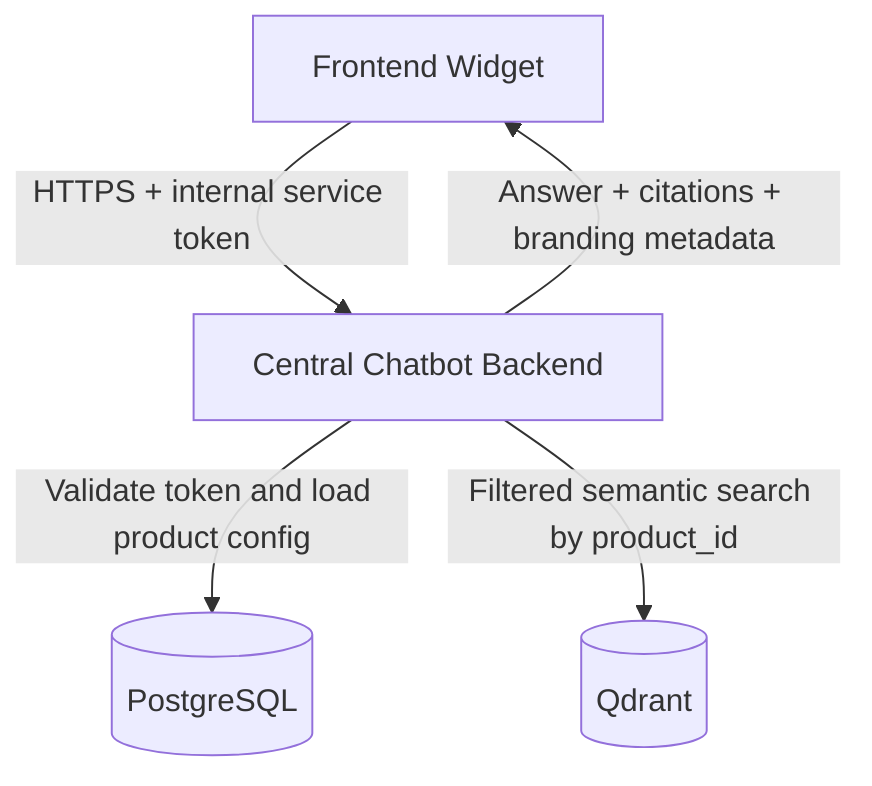
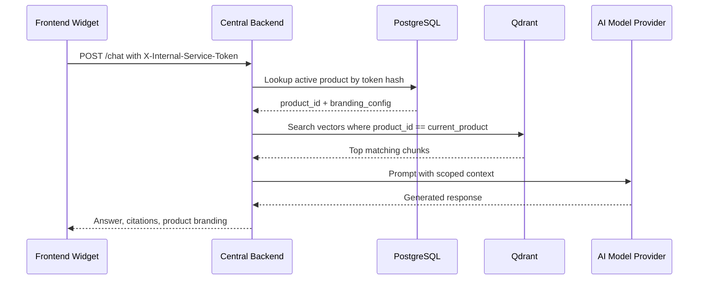
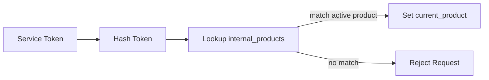

# Internal Multi-Product AI Chatbot Platform Architecture

## Executive Summary

The Internal Multi-Product AI Chatbot Platform is a centralized chatbot engine used by multiple products within the same enterprise. Products such as Tensor, Admissions, Internal Support, HR Portal, Placement Cell, and Knowledge Base integrate a shared frontend widget and route all conversational requests to one backend service.

This is not a SaaS multi-tenant system. All products belong to the same company, and product separation is enforced to protect data boundaries, branding behavior, retrieval scope, and operational ownership.

The platform uses PostgreSQL as the internal product registry and Qdrant as the vector retrieval layer. Every request includes an internal service token. The backend validates the token against PostgreSQL, resolves the current `product_id`, and queries Qdrant with a mandatory `product_id` payload filter.

## System Overview

Core responsibilities:

| Component | Responsibility |
| --- | --- |
| Frontend Widget | Embeddable chat UI used by internal products |
| Central Chatbot Backend | Authentication, routing, orchestration, document upload, retrieval, and response generation |
| PostgreSQL | Internal product registry, hashed tokens, branding configuration |
| Qdrant | Product-scoped vector storage and semantic search |

## High Level Architecture



## Request Flow



## Authentication Flow

1. The frontend widget sends `X-Internal-Service-Token`.
2. The backend hashes the received token using the configured server-side hashing strategy.
3. PostgreSQL is queried for an active product with the matching token hash.
4. If no product is found, the request is rejected with `401 Unauthorized`.
5. If the product is inactive, the request is rejected with `403 Forbidden`.
6. The resolved `product_id` becomes the security context for the request.



## PostgreSQL Overview

PostgreSQL stores the internal product registry. The `internal_products` table contains the product identity, hashed service token, lifecycle state, and JSONB branding configuration used by the frontend widget and backend response layer.

PostgreSQL is the source of truth for:

| Data | Description |
| --- | --- |
| `product_id` | Stable internal product key |
| `product_name` | Human-readable product name |
| `service_token_hash` | Secure hash of the internal service token |
| `branding_config` | JSONB theme and widget configuration |
| `is_active` | Product availability flag |

## Qdrant Overview

Qdrant stores document embeddings and chunk metadata. Each vector payload includes `product_id`, which is used as a mandatory filter during search.

Product-specific vector isolation is enforced using:

```json
{
  "field_name": "product_id",
  "field_schema": {
    "type": "keyword",
    "is_tenant": true,
    "payload_m": 16,
    "m": 0
  }
}
```

This configuration creates independent semantic graph behavior per product and prevents unrelated products from influencing retrieval.

## Product Isolation Strategy

Product isolation is enforced in two layers:

| Layer | Control |
| --- | --- |
| Authentication | Product is resolved from a validated internal service token |
| Retrieval | Every Qdrant query includes `product_id == current_product` |

The backend must never accept `product_id` from client input for authorization. A client may send context metadata, but the effective product identity is always derived from the service token.

## Why Payload Indexing

Payload indexing allows Qdrant to efficiently restrict searches before vector comparison. Because this platform stores data for multiple internal products in one collection, product filtering must be fast, reliable, and mandatory.

Benefits:

| Benefit | Impact |
| --- | --- |
| Fast filtered search | Reduces query latency for product-specific retrieval |
| Isolation | Prevents accidental cross-product retrieval |
| Operational simplicity | Allows one shared collection with scoped access |
| Better recall within product | Tenant graph configuration keeps semantic neighborhoods product-local |

## Security Considerations

Security controls:

| Area | Requirement |
| --- | --- |
| Tokens | Store only hashed tokens; never store plaintext tokens |
| Transport | Require HTTPS for all widget-to-backend traffic |
| Authorization | Resolve product context server-side |
| Logging | Never log service tokens, authorization headers, or full prompts containing sensitive data |
| Qdrant | Always apply product filters in server-owned query builders |
| PostgreSQL | Restrict registry writes to administrative roles |

## Scalability

The architecture scales independently across compute, relational metadata, and vector search.

| Area | Scaling Strategy |
| --- | --- |
| Backend | Horizontal API replicas behind an internal load balancer |
| PostgreSQL | Connection pooling, indexed token hash lookup, read replicas for low-risk reads |
| Qdrant | Collection sharding, payload indexes, tenant graph tuning |
| Documents | Async ingestion workers for chunking and embedding generation |
| Frontend | Static widget bundle delivered through internal CDN |

## Future Enhancements

Recommended enhancements:

| Enhancement | Description |
| --- | --- |
| Token rotation | Support active and pending token hashes per product |
| Audit logging | Record product-scoped administrative and document ingestion events |
| Admin UI | Manage products, branding, and document imports |
| Role-based operations | Separate product admins, platform admins, and support engineers |
| Retrieval evaluation | Track answer quality and source usage by product |
| Data retention policies | Apply retention windows per document type |
| Streaming responses | Add server-sent events or WebSocket support for chat responses |
