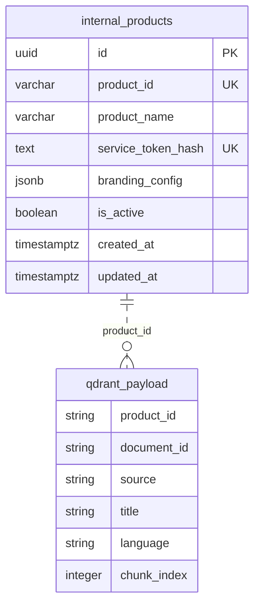

# Database Schema

## Purpose

The `internal_products` table is the product registry for the centralized chatbot platform. It maps internal service tokens to product identities and stores product-level configuration such as branding, widget theme, and lifecycle state.

The table is used during every authenticated request to determine the current product context.

## Table: `internal_products`

| Column | Data Type | Nullable | Default | Constraints | Description |
| --- | --- | --- | --- | --- | --- |
| `id` | `uuid` | No | `gen_random_uuid()` | Primary key | Internal database identifier |
| `product_id` | `varchar(64)` | No | None | Unique; check `^[a-z0-9-]{3,64}$` | Stable product key used in API context and Qdrant payload filters |
| `product_name` | `varchar(160)` | No | None | Required | Human-readable product name |
| `service_token_hash` | `text` | No | None | Unique; required | Hash of the internal service token |
| `branding_config` | `jsonb` | No | `'{}'::jsonb` | JSON object check | Widget branding and UI configuration |
| `is_active` | `boolean` | No | `true` | Required | Whether the product can call chatbot APIs |
| `created_at` | `timestamptz` | No | `now()` | Required | Record creation timestamp |
| `updated_at` | `timestamptz` | No | `now()` | Required | Last update timestamp |

## Constraints

| Constraint | Type | Columns | Purpose |
| --- | --- | --- | --- |
| `internal_products_pkey` | Primary key | `id` | Uniquely identifies each database record |
| `internal_products_product_id_key` | Unique | `product_id` | Prevents duplicate product identities |
| `internal_products_service_token_hash_key` | Unique | `service_token_hash` | Ensures one token maps to one product |
| `internal_products_product_id_format_chk` | Check | `product_id` | Enforces lowercase product identifiers |
| `internal_products_branding_config_object_chk` | Check | `branding_config` | Ensures branding config is a JSON object |

## Indexes

| Index | Columns | Type | Purpose |
| --- | --- | --- | --- |
| `internal_products_service_token_hash_key` | `service_token_hash` | B-tree unique constraint index | Fast authentication lookup |
| `internal_products_product_id_key` | `product_id` | B-tree unique constraint index | Fast product lookup |
| `idx_internal_products_active` | `is_active` | B-tree | Filters active products in admin queries |
| `idx_internal_products_branding_gin` | `branding_config` | GIN | Optional JSONB querying for admin/reporting tools |

## Relationships

`internal_products.product_id` is referenced logically by Qdrant payload metadata. Qdrant does not enforce relational constraints, so the backend must validate product existence before document ingestion.



## Validation Rules

| Field | Rule |
| --- | --- |
| `product_id` | Lowercase letters, numbers, and hyphens only |
| `product_name` | Required, trimmed, 3-160 characters |
| `service_token_hash` | Required, generated by backend tooling, never plaintext |
| `branding_config` | Required JSON object |
| `branding_config.primaryColor` | Valid hex color |
| `branding_config.widgetTitle` | Non-empty string |
| `is_active` | Must be true for API access |

## JSONB Explanation

`branding_config` uses `jsonb` because product branding can evolve without requiring schema migrations for every UI setting. It supports structured validation, indexing, and efficient retrieval.

Example:

```json
{
  "primaryColor": "#2563EB",
  "accentColor": "#14B8A6",
  "widgetTitle": "Tensor Assistant",
  "logoUrl": "TODO - Requires business confirmation: Tensor logo URL",
  "welcomeMessage": "Ask Tensor Assistant about analytics, models, and reports."
}
```

## Example SQL

```sql
CREATE EXTENSION IF NOT EXISTS pgcrypto;

CREATE TABLE internal_products (
    id uuid PRIMARY KEY DEFAULT gen_random_uuid(),
    product_id varchar(64) NOT NULL,
    product_name varchar(160) NOT NULL,
    service_token_hash text NOT NULL,
    branding_config jsonb NOT NULL DEFAULT '{}'::jsonb,
    is_active boolean NOT NULL DEFAULT true,
    created_at timestamptz NOT NULL DEFAULT now(),
    updated_at timestamptz NOT NULL DEFAULT now(),

    CONSTRAINT internal_products_product_id_key
        UNIQUE (product_id),
    CONSTRAINT internal_products_service_token_hash_key
        UNIQUE (service_token_hash),
    CONSTRAINT internal_products_product_id_format_chk
        CHECK (product_id ~ '^[a-z0-9-]{3,64}$'),
    CONSTRAINT internal_products_branding_config_object_chk
        CHECK (jsonb_typeof(branding_config) = 'object')
);

CREATE INDEX idx_internal_products_active
    ON internal_products (is_active);

CREATE INDEX idx_internal_products_branding_gin
    ON internal_products USING gin (branding_config);
```

## Sample Records

| product_id | product_name | is_active | widgetTitle |
| --- | --- | --- | --- |
| `tensor` | Tensor | `true` | Tensor Assistant |
| `admissions` | Admissions | `true` | Admissions Assistant |
| `internal-support` | Internal Support | `true` | Support Assistant |
| `website-analyzer` | Website Analyzer | `true` | Website Analyzer Assistant |

## Example INSERT Statements

```sql
INSERT INTO internal_products (
    product_id,
    product_name,
    service_token_hash,
    branding_config
) VALUES (
    'tensor',
    'Tensor',
    'TODO - Requires business confirmation: Tensor internal service token hash',
    '{
      "primaryColor": "#2563EB",
      "accentColor": "#14B8A6",
      "widgetTitle": "Tensor Assistant",
      "welcomeMessage": "Ask Tensor Assistant about analytics, models, and reports."
    }'::jsonb
);

INSERT INTO internal_products (
    product_id,
    product_name,
    service_token_hash,
    branding_config
) VALUES (
    'hr-portal',
    'HR Portal',
    'TODO - Requires business confirmation: HR Portal internal service token hash',
    '{
      "primaryColor": "#7C3AED",
      "accentColor": "#F59E0B",
      "widgetTitle": "HR Assistant",
      "welcomeMessage": "Ask about policies, leave, benefits, and onboarding."
    }'::jsonb
);
```

## Best Practices

| Practice | Reason |
| --- | --- |
| Store token hashes only | Reduces credential exposure risk |
| Keep `product_id` immutable | Prevents broken vector payload relationships |
| Validate JSONB at application boundaries | Keeps frontend behavior predictable |
| Use connection pooling | Protects PostgreSQL under chat traffic |
| Rotate tokens periodically | Limits blast radius of leaked credentials |
| Audit product changes | Supports operational accountability |
