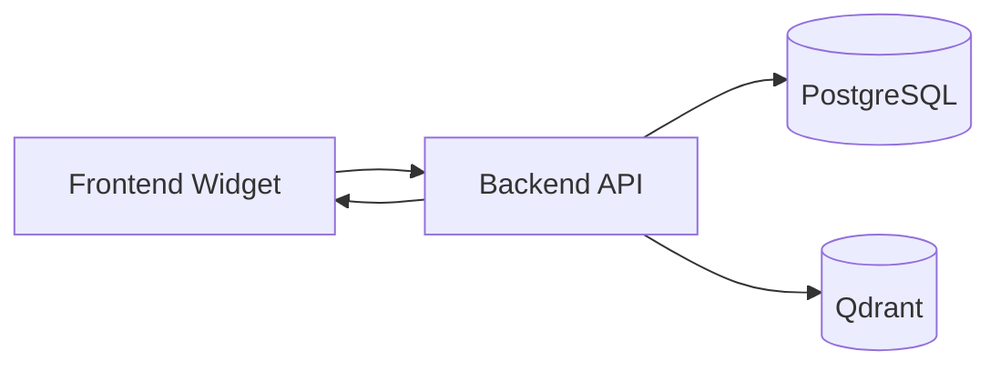

# Request and Response Contracts

## Overview

This document defines communication contracts between the frontend widget, backend service, PostgreSQL, Qdrant, and final frontend responses.

Product identity is always resolved by the backend from the internal service token.



## Frontend to Backend

### Required Fields

| Field | Location | Required | Description |
| --- | --- | --- | --- |
| `X-Internal-Service-Token` | Header | Yes | Product service token |
| `message` | Body | Yes for `/chat` | User message |
| `Content-Type` | Header | Yes for JSON requests | Must be `application/json` |

### Optional Fields

| Field | Description |
| --- | --- |
| `conversation_id` | Existing conversation identifier |
| `user` | User metadata for audit and personalization |
| `context` | Locale, channel, page, or feature context |

### Validation

| Rule | Behavior |
| --- | --- |
| Missing token | Return `401` |
| Invalid token | Return `401` |
| Inactive product | Return `403` |
| Empty message | Return `400` |
| Oversized message | Return `400` |

## Backend to PostgreSQL

### Token Lookup Contract

Input:

| Field | Required | Description |
| --- | --- | --- |
| `service_token_hash` | Yes | Hash of received service token |

Output:

| Field | Required | Description |
| --- | --- | --- |
| `product_id` | Yes | Product context for request |
| `product_name` | Yes | Display name |
| `branding_config` | Yes | Widget configuration |
| `is_active` | Yes | Access control flag |

Example query:

```sql
SELECT product_id, product_name, branding_config, is_active
FROM internal_products
WHERE service_token_hash = $1;
```

## Backend to Qdrant

### Required Fields

| Field | Required | Description |
| --- | --- | --- |
| `vector` | Yes | Query embedding |
| `limit` | Yes | Number of results |
| `filter.must.product_id` | Yes | Product isolation filter |

Example:

```json
{
  "vector": [0.012, -0.481, 0.224],
  "limit": 5,
  "filter": {
    "must": [
      {
        "key": "product_id",
        "match": {
          "value": "tensor"
        }
      }
    ]
  }
}
```

## Backend to Frontend

### Success Contract

```json
{
  "conversation_id": "conv_01HZX9Y7A6P2",
  "message_id": "msg_01HZX9Z2J8N5",
  "answer": "You can find the leave policy in HR Portal under Policies > Leave and Attendance.",
  "citations": [
    {
      "document_id": "doc_hr_leave_policy",
      "title": "Leave and Attendance Policy",
      "source": "hr-portal/policies/leave-and-attendance.md",
      "chunk_index": 2
    }
  ],
  "branding": {
    "widgetTitle": "HR Assistant",
    "primaryColor": "#7C3AED"
  }
}
```

### Error Contract

```json
{
  "error": {
    "code": "INVALID_REQUEST",
    "message": "The message field is required.",
    "request_id": "req_01HZX8R2J3C4VT",
    "details": [
      {
        "field": "message",
        "reason": "required"
      }
    ]
  }
}
```

## Error Codes

| Code | HTTP Status | Description |
| --- | --- | --- |
| `INVALID_REQUEST` | `400` | Request body or query parameters are invalid |
| `UNAUTHORIZED` | `401` | Service token is missing or invalid |
| `PRODUCT_DISABLED` | `403` | Product is inactive |
| `FORBIDDEN` | `403` | Caller lacks permission |
| `NOT_FOUND` | `404` | Requested resource was not found |
| `CONFLICT` | `409` | Resource already exists |
| `RATE_LIMITED` | `429` | Request limit exceeded |
| `DEPENDENCY_UNAVAILABLE` | `503` | PostgreSQL, Qdrant, or model provider unavailable |

## Response Requirements

| Requirement | Description |
| --- | --- |
| Stable request IDs | Every error must include a traceable `request_id` |
| No token echoing | Tokens and token hashes must never be returned |
| Product-scoped citations | Citations must come only from the authenticated product |
| Consistent JSON shape | Clients should be able to rely on stable response fields |
