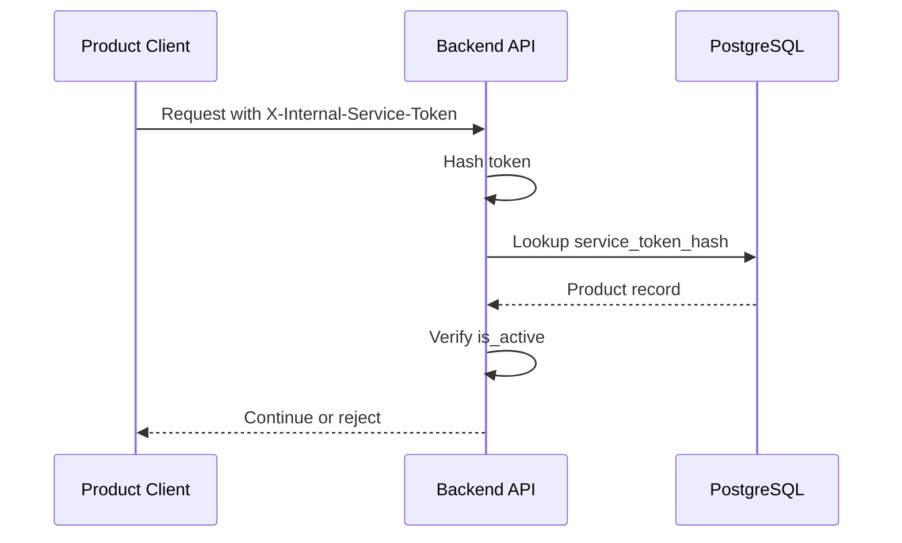

# Security

## Security Model

The platform uses internal service tokens to identify products. Each product belongs to the same company, but product data must remain isolated across retrieval, logging, and response generation.

Security objectives:

| Objective | Control |
| --- | --- |
| Authenticate product calls | Internal service token validation |
| Protect tokens | Hashing and secret management |
| Isolate product data | Mandatory `product_id` retrieval filter |
| Reduce data leakage | Logging and response controls |
| Protect infrastructure | Restricted PostgreSQL and Qdrant access |

## Internal Service Tokens

Each product receives an internal service token used by its frontend widget or server-side integration.

Requirements:

| Requirement | Description |
| --- | --- |
| High entropy | Use cryptographically secure random tokens |
| HTTPS only | Tokens must never be transmitted over plaintext channels |
| No browser persistence unless approved | Prefer runtime configuration or server-issued widget config |
| Rotation support | Tokens should be rotated on a defined schedule |
| Scope per product | One token should map to one product context |

## Hashing

Plaintext service tokens must never be stored. Store only a secure hash in `internal_products.service_token_hash`.

Recommended approach:

| Area | Recommendation |
| --- | --- |
| Algorithm | Argon2id or bcrypt with strong cost settings |
| Comparison | Constant-time comparison |
| Storage | Store only hash and algorithm metadata |
| Logs | Never log plaintext tokens or hashes |

## Authentication Flow



## Authorization

Authorization is product-scoped. Once authenticated, the caller can only access documents and chat behavior for the resolved product.

Rules:

| Rule | Description |
| --- | --- |
| Server-owned product identity | Ignore client-provided `product_id` for authorization |
| Admin APIs require admin scope | Product creation and listing should be restricted |
| Inactive products denied | `is_active = false` returns `403` |
| Document upload scoped | Uploaded documents are stamped with resolved `product_id` |

## Product Isolation

Qdrant searches must include:

```json
{
  "key": "product_id",
  "match": {
    "value": "current_product"
  }
}
```

Isolation guarantees:

| Guarantee | Implementation |
| --- | --- |
| No cross-product retrieval | Mandatory `product_id` filter |
| No client override | Product ID derived from token |
| Indexed filtering | Tenant-aware payload index |
| Product-local semantic graph | `is_tenant = true`, `payload_m = 16`, `m = 0` |

## Secrets Management

| Secret | Storage |
| --- | --- |
| Service token plaintext | Secret manager only |
| Token hashes | PostgreSQL |
| Database credentials | Secret manager or platform vault |
| Qdrant API key | Secret manager |
| Model provider API key | Secret manager |

Best practices:

| Practice | Reason |
| --- | --- |
| Use environment injection | Avoid committing secrets |
| Rotate credentials | Limit exposure window |
| Restrict read access | Reduce accidental leakage |
| Separate dev/stage/prod secrets | Prevent environment crossover |

## Database Security

| Control | Recommendation |
| --- | --- |
| TLS | Require encrypted PostgreSQL connections |
| Roles | Separate read, write, migration, and admin users |
| Backups | Encrypt at rest |
| Auditing | Log product registry changes |
| Least privilege | Backend should not own migration-level permissions |

## Qdrant Security

| Control | Recommendation |
| --- | --- |
| Network | Restrict to backend and ingestion workers |
| API keys | Use secret-managed credentials |
| Filters | Build filters in backend-owned retrieval code |
| Payload hygiene | Avoid storing unnecessary sensitive metadata |
| Collection changes | Restrict index and collection modification permissions |

## Best Practices

| Practice | Description |
| --- | --- |
| Centralize authentication middleware | Keeps endpoint behavior consistent |
| Enforce retrieval filters in one query builder | Reduces bypass risk |
| Add isolation tests | Verify products cannot retrieve each other's content |
| Redact logs | Remove tokens, prompts with sensitive data, and personal data |
| Use request IDs | Supports incident investigation |
| Monitor unusual access | Detect spikes, repeated failures, and product misuse |
