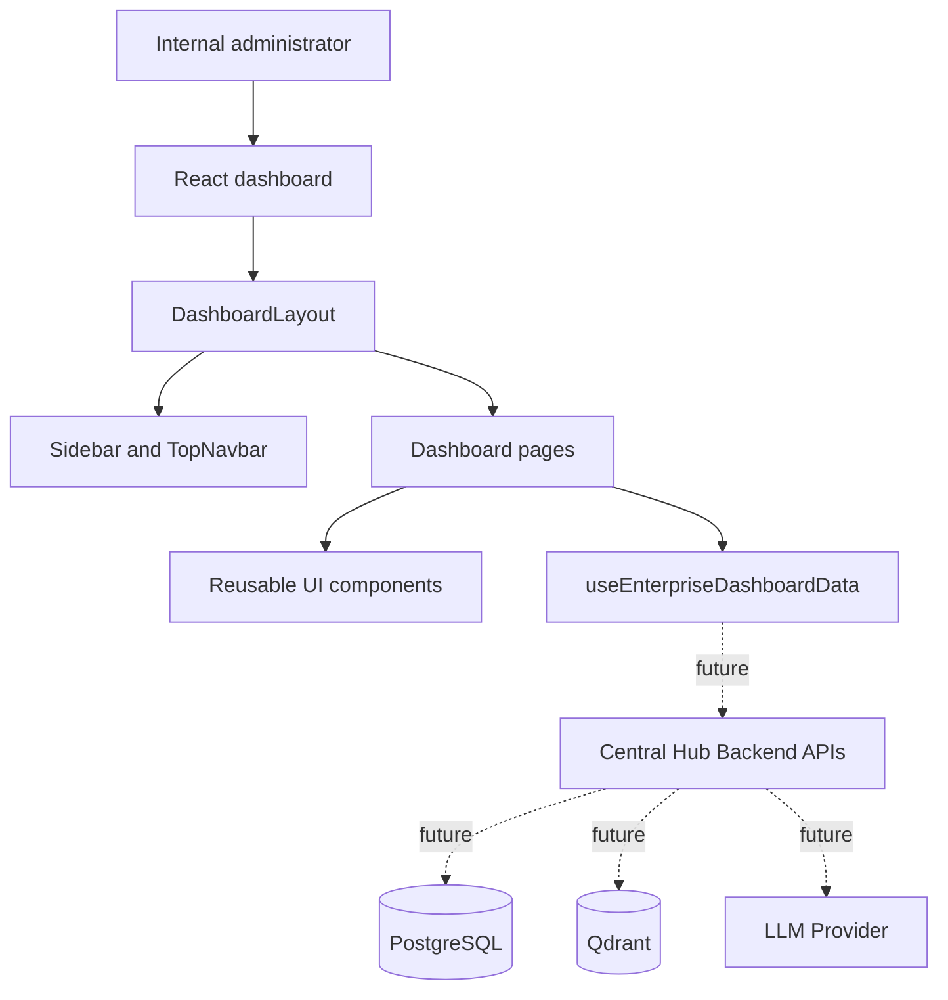
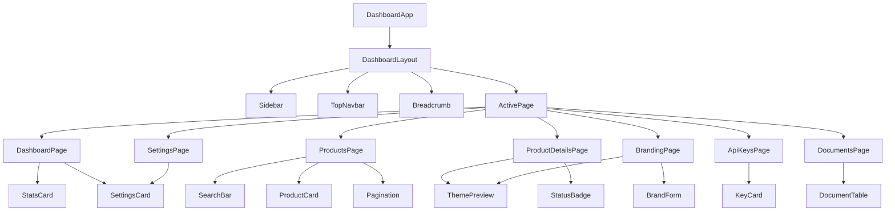
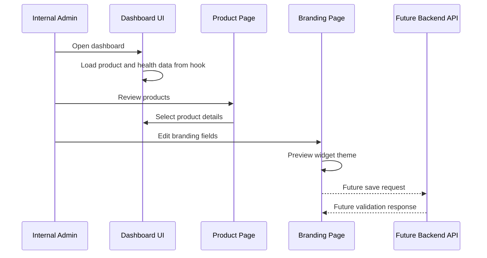

# Internal Dashboard Layout

## Purpose

The internal management dashboard provides one operational surface for managing all enterprise chatbot products. It is designed for administrators, platform engineers, support owners, and product operators who need visibility into product status, branding, API key state, document ingestion, and system dependencies.

This dashboard is not a SaaS tenant console. It manages products owned by the same enterprise:

| Product |
| --- |
| Tensor |
| Admissions |
| Internal Support |
| HR Portal |
| Placement Cell |
| Website Analyzer |
| Knowledge Base |

## Architecture

The dashboard is a frontend-only layout in the current implementation. It is intentionally structured around reusable components and a data hook that can later be replaced by authenticated backend API calls.

## Navigation

| Navigation Item | Purpose |
| --- | --- |
| Dashboard | Shows operational summary and platform health |
| Products | Lists every internal product with status and branding preview |
| Product Details | Shows product metadata, branding configuration, service token status, theme preview, and widget preview |
| Branding | Provides a form-oriented layout for authorized branding updates |
| API Keys | Shows masked service key status and key lifecycle actions |
| Documents | Lists uploaded files, generated markdown, chunk counts, embedding state, ownership, and classification |
| Settings | Shows infrastructure configuration for PostgreSQL, Qdrant, LLM, storage, environment, and system version |

## Role of Each Page

| Page | Role |
| --- | --- |
| Dashboard | Gives administrators a fast health and volume overview |
| Products | Supports product discovery, status review, and navigation to product details |
| Product Details | Centralizes product identity, token status, branding values, theme preview, and widget preview |
| Branding | Provides a controlled surface for editing JSONB-backed branding values |
| API Keys | Supports token governance without exposing plaintext credentials |
| Documents | Provides operational visibility into ingestion and embedding state |
| Settings | Shows infrastructure and runtime configuration at a glance |

## Component Hierarchy

## User Flow

## Future Scalability

The dashboard can scale without changing the core layout model.

| Capability | Future Direction |
| --- | --- |
| Backend integration | Replace the local dashboard hook with authenticated calls to central hub APIs |
| Product growth | Add products through `internal_products` records and render them dynamically |
| Role-based access | Gate pages and actions by enterprise roles such as platform admin, product owner, and auditor |
| Audit trails | Add change history for branding, service token rotation, and ingestion actions |
| Document operations | Connect document upload, re-embedding, and classification workflows |
| Health monitoring | Replace static settings cards with live PostgreSQL, Qdrant, storage, and LLM checks |
| Schema evolution | Use `branding_config.version` to migrate older JSONB objects safely |
